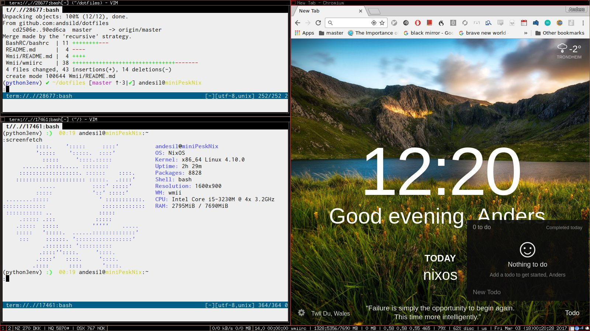

### Why use WMII instead of i3?
i3 is a successor and more actively maintained. I just like wmii (i2) because I've spent time with it.  

To reload the configuration in wmii, type `MODKEY-a` and type in `exec wmii`.

#####Screenshot

